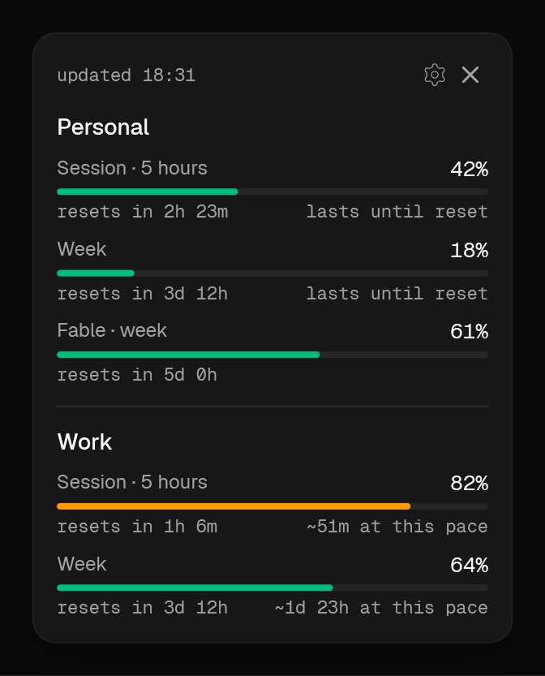

# Aiko

**See how much of your Claude Code limits is left, for two accounts at once, without opening a
terminal.**

Aiko sits in the Windows tray. Rest the mouse on it and a card shows every environment you set up:
the five-hour window, the week, and the weekly limit of the heavy model. For each one you see when
it resets and how long it lasts at your current pace.



Free and open source. Not affiliated with Anthropic.

## Why two accounts

Many people have a work account and a personal one, in separate Claude Code folders. `/usage` shows
only the account you're in. Aiko shows both side by side. An environment is a name you choose and
the Claude Code folder behind it.

Environment 1 is always the `.claude` folder in your home: the VS Code panel, Claude Desktop and a
plain `claude` use it too. Environment 2 has a folder of its own, such as `.claude-work`. On the first
run a checklist finds the folders you already have or makes a new one. You sign in through Claude Code
itself, so Aiko never sees your password or token.

## Launch commands and project folders

If you want, Aiko adds a command for each environment. `aiko-work` starts Claude Code in the work
account from any folder, in PowerShell, cmd and Git Bash. The name is up to you.

You can also bind project folders to an environment. A plain `claude` in `D:\work`, or in any folder
inside it, then starts the work account, and every other folder gets the default environment. A
command wins over a binding, and Claude Code reminds you when the two don't match.

For this, Aiko puts a small `claude.exe` of its own first in your user PATH. It picks the account and
starts the real Claude Code. If your PowerShell profile has functions that switch accounts, Aiko can
turn them off, since they would hide the commands. It keeps a copy of the profile.

JetBrains IDEs take `claude` from PATH too, but nobody has tried Aiko with them yet.

## Aiko's personality and skills

Turn on the personality for an environment, and Claude Code sessions there talk as Aiko: an indie game
developer who works next to you. You pick how loud she is, from Quiet to 無双, and the settings show a
sample answer for each level. She stays quiet where it matters: code, commits, files, pull requests,
error explanations, security warnings, dangerous actions and bad news are written in a plain neutral
voice. The switch works in new sessions; open sessions finish the way they started.

With the personality come eleven skills, with one switch for all of them. They live in one plugin
called `aiko`, so you call a skill by its full name:

**Project management**

| Skill | What it is for |
|---|---|
| `/aiko:copy` | UI text, READMEs and release notes that read as written by a person, in Russian and English |
| `/aiko:docs-hygiene` | a state file built from measured facts, a decision log, duplicates and contradictions found |
| `/aiko:release-gate` | a check before a release: GO or NO-GO, irreversible changes, rollout and rollback |
| `/aiko:calendar` | a day planned around Google Calendar, free time found, events added after your yes |
| `/aiko:drive` | documents from Google Drive read into the work, project files put onto Drive |

**Game development**

| Skill | What it is for |
|---|---|
| `/aiko:gamedesign-research` | one game mechanic across 30-40 games, with an illustrated review and playable stands |
| `/aiko:playtest` | a game checked with numbers: the same test scene before and after a change |
| `/aiko:blender-to-unity` | meshes from Blender into Unity without mirrored or rotated surprises |
| `/aiko:texturing` | ready files for textures: a size that fits the camera, and sheets to paint over |
| `/aiko:glb-for-web` | a Blender model as a `.glb` that web players show correctly |
| `/aiko:palette` | colours checked against a palette and fixed with the smallest change, in OKLCH |

The `calendar` and `drive` skills need the Google Calendar and Google Drive connectors, turned on in
Claude's connector settings.

Aiko installs all of this as Claude Code plugins from a marketplace on your own computer, so nothing is
downloaded. Your own plugins, output style and settings stay as they are. If you set your own output
style, the settings page tells you that the personality's style wins while it is on.

Where the personality is on, Aiko's face shows up in the tray or on the island for two seconds when a
session starts working, waits for you, finishes, fails or runs out of limit. Chibi or emoji, your pick.

The skills also work without Aiko:

```
/plugin marketplace add Slayumind/aiko
/plugin install aiko@slayumind-aiko
```

## How Aiko gets the numbers

Claude Code runs a status line command after every answer and passes it the limits. Aiko adds one
line to your Claude Code settings, so that command is Aiko's own small program. It keeps the
numbers and drops everything else. **This needs no token**, and nothing leaves your computer.

If you already have a status line, Aiko keeps it: your command still runs and its output still
shows.

The status line runs only in the Claude Code CLI. If you work in the VS Code panel or in Claude
Desktop, turn on **direct mode** for that environment, and Aiko asks the usage API itself. Direct
mode needs the account's access token, so it's off until you turn it on.
[PRIVACY.md](PRIVACY.md) describes exactly what happens with the token.

If you allow it, Aiko also counts how many copies run each day. It has its own switch on the
**Privacy** page, off by default and separate from the update check. The ID it sends changes every
day, so two days can't be linked to one person, and the rows are deleted after 90 days. That page
lists the six things that go, line by line; so does [PRIVACY.md](PRIVACY.md).

## What you need

- Windows 10 version 1809 or newer, 64-bit.
- Claude Code 2.1.80 or newer. Older versions don't report limits.
- For the personality and the skills, a recent Claude Code: tested with 2.1.272.
- A Claude.ai Pro, Max or Team plan. Enterprise accounts don't report limits.

## Install

Download the installer from [Releases](https://github.com/Slayumind/aiko/releases/latest) and run
it. Aiko installs for the current user and needs no administrator rights.

The build isn't signed yet, so **SmartScreen will warn you**. Choose *More info*, then *Run
anyway*. Signing is planned. Until then, every release comes with `SHA256SUMS.txt` and a build
provenance attestation, and [SECURITY.md](SECURITY.md) shows how to check them.

Windows 11 hides new app icons under the arrow next to the clock. Open the arrow and drag Aiko onto
the taskbar: under the arrow, the card can't open.

## Remove

Uninstall Aiko from **Installed apps**. It puts your status line back and removes the session
reminder, removes its plugins and their marketplace from Claude Code, takes its folder out of PATH
together with the launch commands, turns your PowerShell profile functions back on, removes its
startup entry and deletes its own folders. Your accounts and
history stay in their Claude Code folders. There's nothing left to clean up by hand.

## Build it yourself

You need the .NET 10 SDK and nothing else.

```
git clone https://github.com/Slayumind/aiko.git
cd aiko
dotnet test Aiko.slnx
dotnet run --project src/Aiko.App
```

- `src/Aiko.Core` decides what to show: parsing, thresholds, countdowns, placement. It has no
  Windows code and no UI, and every part of it has tests.
- `src/Aiko.App` has the tray icon, the windows and the network. It draws what the core decided.
- `src/Aiko.Bridge` is the small program Claude Code runs as its status line, for the personality's
  hooks and to build the personality plugin.
- `src/Aiko.Shim` is the small `claude.exe` behind launch commands and project folders.
- `plugins/aiko` is the skills plugin, one folder per skill, with tests for their scripts (`node --test` and
  `python -m unittest`).

To change something, read [CONTRIBUTING.md](CONTRIBUTING.md) first. It also lists what Aiko won't do.

## Acknowledgements

Inspired by [notchi](https://github.com/sk-ruban/notchi), GPL-3.0. Aiko contains no code or assets
from notchi.

The typefaces are [Geist and Geist Mono](https://github.com/vercel/geist-font) by Vercel, under the
SIL Open Font License. Other notices are in [THIRD-PARTY-NOTICES.md](THIRD-PARTY-NOTICES.md).

## Licence

[Apache-2.0](LICENSE), with [NOTICE](NOTICE).

"Claude" and "Anthropic" are trademarks of Anthropic PBC. Aiko is an independent project and isn't
affiliated with, endorsed by or sponsored by Anthropic.
